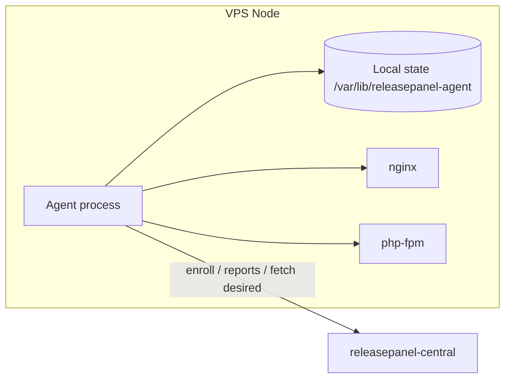

# Releasepanel Agent — Runtime Appliance Architecture

This repository is the **runtime authority** installed on VPS nodes: it enrolls with **releasepanel-central**, reports inventory and health, executes deployments, and drives convergence toward declared desired state. It is not a generic hosting panel and not a Kubernetes-style orchestrator.

Design principles:

- **Stable**: few moving parts, explicit failure modes, no implicit magic.
- **Minimal**: file-backed state, standard Unix tooling at the edges (nginx, php-fpm, systemd).
- **Deterministic**: versioned schemas, stable ordering of operations, reproducible reports.
- **Operational**: clear logs, exit codes, and inspectable local files.
- **Local-first**: authoritative facts live on disk on the node; central receives reports and issues intents.

## Logical components

| Component | Responsibility |
|-----------|----------------|
| **Enrollment** | One-time (or rare) exchange with central: provisioned token → node identity + credentials. |
| **Config** | Static paths, central URL, intervals; no dynamic cluster discovery in v1. |
| **Local state** | Atomic JSON files under a single state root; schema-versioned. |
| **Inventory** | Periodic snapshot of hardware/OS/runtime facts (versions, paths, listeners). |
| **Health** | Lightweight probes for nginx, php-fpm, disk; structured pass/fail + detail. |
| **Deploy runner** | Executes a **declared pipeline** (fetch → validate → apply → verify → report); advanced strategies come later. |
| **Convergence** | Compare last **applied** manifest fingerprint vs **desired** from central; re-run pipeline until match or terminal error. |
| **Runtime adapters** | Thin wrappers: `nginx -t`, reload signals, `php-fpm` pool checks — no plugin architecture. |

## High-level data flow

## Threat model (v1)

- Enrollment token is **short-lived** or single-use; persisted credentials are **node-scoped** and stored `0600`.
- All central calls use **TLS**; certificate verification on by default (optional dev skip documented, not default in prod).
- Agent never stores central-wide secrets; only this node’s credentials.

## Non-goals (this phase)

- UI, multi-tenant panels, plugin SDKs, Helm-style abstractions, advanced rollout logic (canary, mesh).

## Related documents

- [Central HTTP API (paths & rollout)](CENTRAL_API.md)
- [Enrollment](ENROLLMENT.md)
- [Deploy pipeline](DEPLOY_PIPELINE.md)
- [Convergence & inventory](CONVERGENCE.md)
- [Filesystem layout](FILESYSTEM.md)
- [Environment & application model](ENVIRONMENT_MODEL.md)
